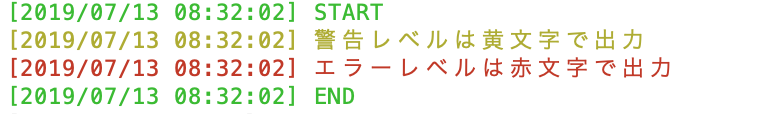

# ログを出力したい

## 画面に出すだけ

```bash
function log() {
  d=`date +"%Y/%m/%d %H:%M:%S"`
  echo -e "\e[$2m[$d] $1\e[m"
}

function logi() {
  log $1 32
}

function logw() {
  log $1 33
}

function loge() {
  log $1 31
}

logi "START"
logw "警告レベルは黄文字で出力"
loge "エラーレベルは赤文字で出力"
logi "END"
```


