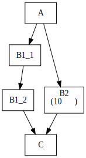

# バッチ実行システムの比較

## 要求事項

1. バッチ実行OS
   1. Windows, CentOS6で処理を実行できること
   1. できればCentOS7, macosでも処理を実行できること
1. 処理どうしの関係
   1. 複数の処理を直列・並列組み合わせて実行できること (下図 A → B1_1・B2、B1_2・B2 → C)
   1. 並列実行中の1つのフロー中で直列実行を指定できること (下図 B1_1 → B1_2)
   1. 1つの処理を複数のホストで分散して実行できこと (下図 B2)
1. 実行に必要なリソースをno configで配布できること
   * 「実行ホストごとにSSH鍵を登録する必要がある」などは困る



## 候補

* Jenkins (v2.176.1)
  * Declarative Pipelineだと「特定の `stage` を複数のノードに実行させる」や「`parallel`中の`parallel`」は不可能な模様
  * Scripted Pipelineで実現可能 (後ろに`Jenkinsfile`を記載)
* ~~Gitlab Ci (v11.11.3)~~
  * B1_1 → B1_2 を設定できない
  * B2の分散自体はスクリプト内で処理する必要あり → [GitLab での 並列 CI パターン - Qiita](https://qiita.com/utrhira/items/0227a0dde84d193132c2#parallelによる多重度指定)
* Rundesk
* Hinemos
  * macosはサポート外
* Airflow
* Digdag
* Azkaban

### Jenkinsfile

```groovy
// Scrpted Pipeline
node('windows') {
  stage('A') {
    bat "echo A"
  }
}

stage('B') {
  def jobs_b = [:]

  jobs_b['B1'] = {
    node ('centos6') {
      sh "echo B1-1"
    }
    node ('windows') {
      bat "echo B1-2"
    }
  }

  jobs_b['B2'] = {
    node ('centos6') {
      def jobs_b2 = [:]

      for (i = 1; i <= 10; i++) {
        def counter = i

        jobs_b2["B2-$counter"] = {
          sh "echo B2-$counter"
        }
      }

      parallel jobs_b2
    }
  }

  parallel jobs_b
}

node('centos6') {
  stage('C') {
    sh "echo C"
  }
}
```
